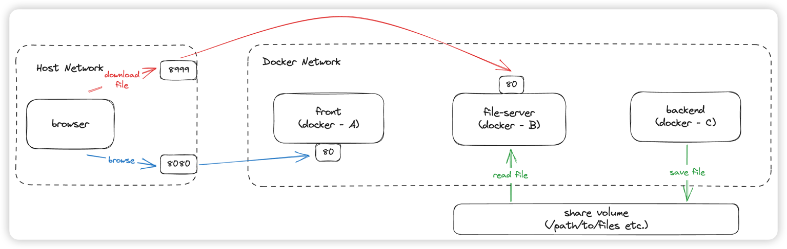
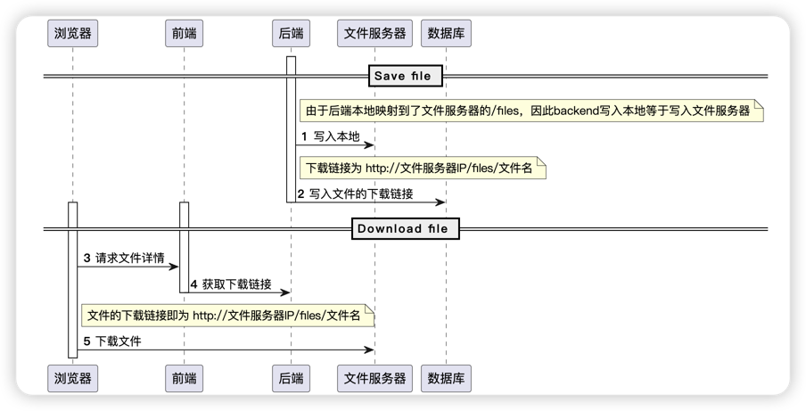

# Ant Design Pro

This project is initialized with [Ant Design Pro](https://pro.ant.design). Follow is the quick guide for how to use.

## 依赖

nodejs v16.20.0

## 开发 mock 环境启动

在系统根目录下执行：

```shell
npm install tyarn -g && tyarn
npm run start
```

## 部署架构



🍓 若端口配置如上图，假设生成的文件为 `测试文件.txt`，则 DB 中存放的文件地址应当为 `http://127.0.0.1:8999/files/测试文件.txt`

## 核心流程



## 构建生产环境容器并使用

1. 按需更新 `.deploy/.env` 中的配置：
   - HOST_FRONT_PORT：前端映射到本机的端口
   - HOST_FS_PORT：文件服务器映射到本机的端口，决定了存放在数据库中的文件地址：`http://127.0.0.1:HOST_FS_PORT/files/`
   - HOST_FILE_PATH：后端服务生成的文件绝对路径
2. 更新 `deploy/nginx.conf` 中的 `proxy_pass` 为后端服务地址，例如：

   ```text
   proxy_pass http://127.0.0.1:8000;
   ```

   > 例如后端服务部署在本机，前端部署在容器中，则将该地址替换为本机的地址。
   >
   > 在 mac 中可以通过 `ifconfig` 查看 `en0` 端口的地址，如 `192.168.150.22`，则替换为 `proxy_pass http://192.168.150.22:8080;`

3. 构建并运行生产环境容器

   在项目根目录下执行：

   ```shell
   docker-compose -f ./deploy/docker-compose.yml up -d
   ```

4. 停止并删除容器

   在项目根目录下执行：

   ```shell
   docker-compose -f ./deploy/docker-compose.yml down
   ```
